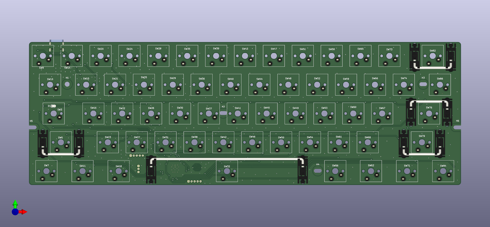

# goose60

goose60 是一個 60% 鍵盤 PCB 電路板專案。

goose60 的設計目標是做出一把**無光害的熱插拔鍵盤**，MCU 採用 ARM Cortex-M3 的 STM32F103。所有按鍵位置皆支援軸體熱插拔，本系列含子專案皆為無光害版本，故電路上僅會有的 `caps lock` 指示燈。

goose60 支援 **default 60%** 布局與 **ISO 60%** 布局，子專案 JY60 支援 HHKB 布局的專案，未來視情況需要，再製作其他布局的子專案。

## 3D 預覽

